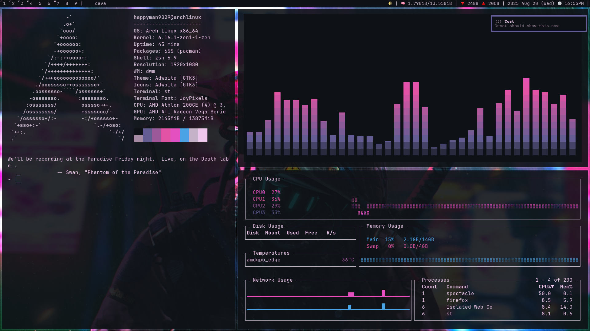
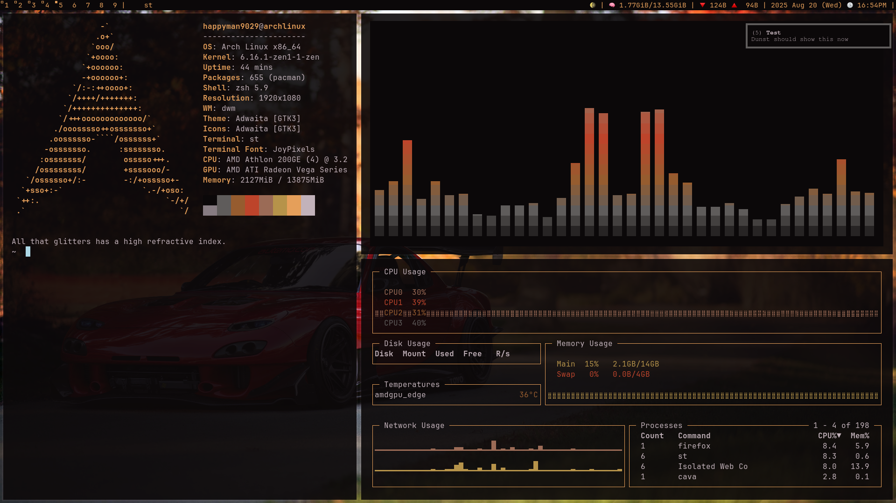
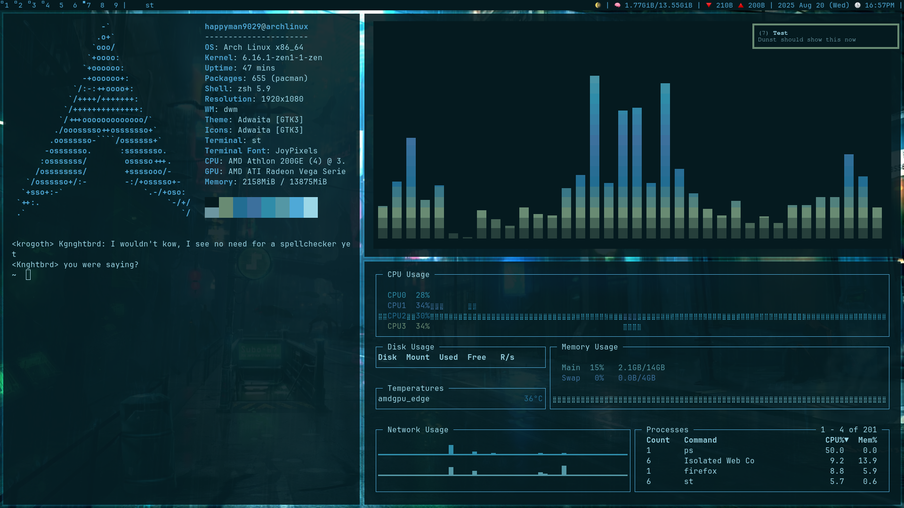
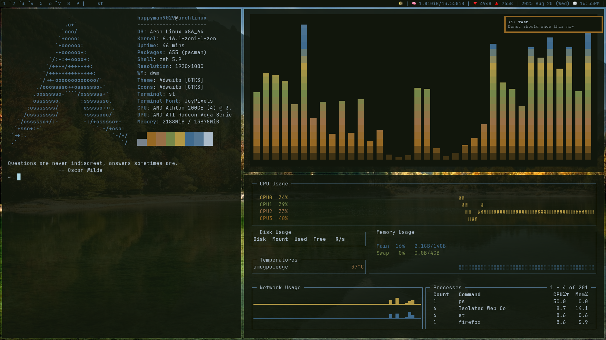
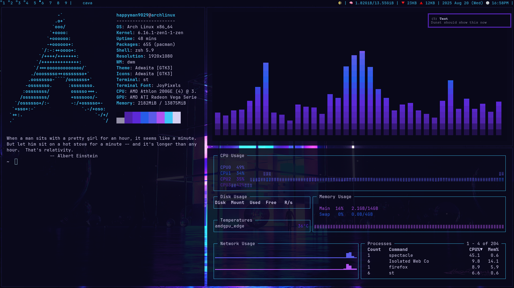

# **Auto Wallpaper Themer**

Automatic wallpaper & color theme generator for terminals, notifications, and Cava — aesthetic unleashed.










<figcaptio><a href="https://github.com/happyman09/auto-wallpaper-themer/tree/main/assets">click to see the wallpapers used</a></figcaption>

## Features:  
- Picks a random wallpaper from your folder with wallpapers inside 
- Updates terminal colors with Pywal 
- Syncs colors to Cava visualizer and Dunst notifications  
- Fully automated, aesthetic-focused  

## Installation & Usage:  
Clone the repo:  

```
git clone https://github.com/happyman09/auto-wallpaper-themer.git
cd auto-wallpaper-themer
```

## Make the script executable and run it:
```
chmod +x pywallpaper.sh
./pywallpaper.sh
```
**Remainder to change path to folder**
Your wallpaper, Pywal colors, Cava, and Dunst will all update automatically.

***⚠️Before running the script, make sure to copy both config.base and config to your Cava configuration directory (~/.config/cava/) so the visualizer works correctly:⚠️***

```
cp config.base config ~/.config/cava/
```

### Config Files:

    config.base → default/template Cava config for reference    
    config → dynamic Cava color config used by the script

## Notes:

   - Ensure `jq`, `pywal`, `xwallpaper`, `xdotool`, `libnotify`, `Cava`, and `Dunst` are installed

   - The script updates your terminal, notifications, and visualizer colors based on the selected wallpaper

   - You can modify `config.base` for default Cava settings and the script will overwrite `config` dynamically

   - Works in `xorg` based setups, full funtionality on Wayland is not guaranteed
